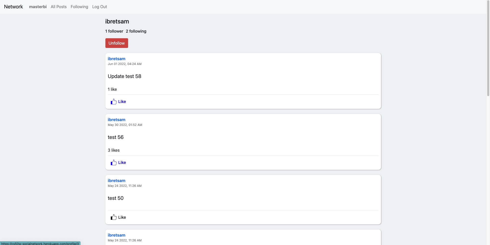

# CS50 Project 4: Social Network

5th project from the online course [CS50's Web Programming with Python and JavaScript](https://cs50.harvard.edu/web/). The main goal for this project is to design a Twitter-like social network website for making posts and following users. This project uses Django as backend and Vanilla Javascipt for frontend.

See live demo here: https://cs50w-socialnetwork.herokuapp.com/

## Technologies used:
- Python:
    - Django
- Javascript:
    - Uses `Fetch API` for all API calls to communicate with backend.
- Bootstrap:
    - Uses Bootstrap for CSS decoration

## Project specification: 
Using Python, JavaScript, HTML, and CSS, complete the implementation of a social network that allows users to make posts, follow other users, and “like” posts. The following requirements must be fulfilled:
- **New Post**: Users who are signed in should be able to write a new text-based post by filling in text into a text area and then clicking a button to submit the post.
- **All Posts**: The “All Posts” link in the navigation bar should take the user to a page where they can see all posts from all users, with the most recent posts first.
    - Each post should include the username of the poster, the post content itself, the date and time at which the post was made, and the number of “likes” the post has (this will be 0 for all posts until you implement the ability to “like” a post later).
- **Profile Page**: Clicking on a username should load that user’s profile page. This page should:
    - Display the number of followers the user has, as well as the number of people that the user follows.
    - Display all of the posts for that user, in reverse chronological order.
    - For any other user who is signed in, this page should also display a “Follow” or “Unfollow” button that will let the current user toggle whether or not they are following this user’s posts. Note that this only applies to any “other” user: a user should not be able to follow themselves.
- **Following**: The “Following” link in the navigation bar should take the user to a page where they see all posts made by users that the current user follows.
    - This page should behave just as the “All Posts” page does, just with a more limited set of posts.
    - This page should only be available to users who are signed in.
- **Pagination**: On any page that displays posts, posts should only be displayed 10 on a page. If there are more than ten posts, a “Next” button should appear to take the user to the next page of posts (which should be older than the current page of posts). If not on the first page, a “Previous” button should appear to take the user to the previous page of posts as well.
- **Edit Post**: Users should be able to click an “Edit” button or link on any of their own posts to edit that post.
    - When a user clicks “Edit” for one of their own posts, the content of their post should be replaced with a textarea where the user can edit the content of their post.
    - The user should then be able to “Save” the edited post. Using JavaScript, you should be able to achieve this without requiring a reload of the entire page.
    - For security, ensure that your application is designed such that it is not possible for a user, via any route, to edit another user’s posts.
- **“Like” and “Unlike”**: Users should be able to click a button or link on any post to toggle whether or not they “like” that post.
    - Using JavaScript, you should asynchronously let the server know to update the like count (as via a call to fetch) and then update the post’s like count displayed on the page, without requiring a reload of the entire page.

## How to run
1. Clone this repo
```
git clone https://github.com/ibretsam/CS50-Project-4.git
```
2. Navigate to the project directory, create a virtual environment and activate it:
```
cd network

# Create a virtual environment
python3 -m venv venv

# Activate virtual environment
	# macOS:
	source venv/bin/activate
	# Windows:
	venv/Scripts/activate.bat
```
3. Install required python dependencies
```
pip install -r requirements.txt
```
4. Start the Django web server
```
python manage.py runserver
```
5. Go to the URL provided in the terminal and you should be redirected to the Homepage!

## Usage
When open then index page (`/`), you should be direct to the login page, you can login or register an account here, then login, you will be direct to the `homepage` which is the `All Post` page, this page will display all the posts of all users in the data.


In this page, you can create a new post, by typing the content of the post in the text area at the beginning of the page and click post, it will shows new post on the feed just like in Facebook or Twitter.

You can also edit your posts by clicking on the edit icon of each of your posts, then edit the content in the textarea, then click `Update`, otherwise, if you want to cancel, just click `Cancel`.


You can also "like" or "unlike" a post just by clicking on the like button below each post. The total liked number will be update automatically.

By clicking on a username, you will be direct to a Profile Page


On this page, it will show the number of followers or following that the user has, and all the post by that user.

If the profile you're clicking on is not you, it will display an additional `Follow` or `Unfollow` button depend on if you follow that profile or not.



By clicking on `Follow` or `Unfollow` button, you can add or remove that profile to or from your following list, this will automatically update on your profile page too.

If you're following a profile, that profile posts will be shown on your `Following page`.


This page is just like the `All Post` page, but it's only display posts of profile you're following.

Thanks you!
